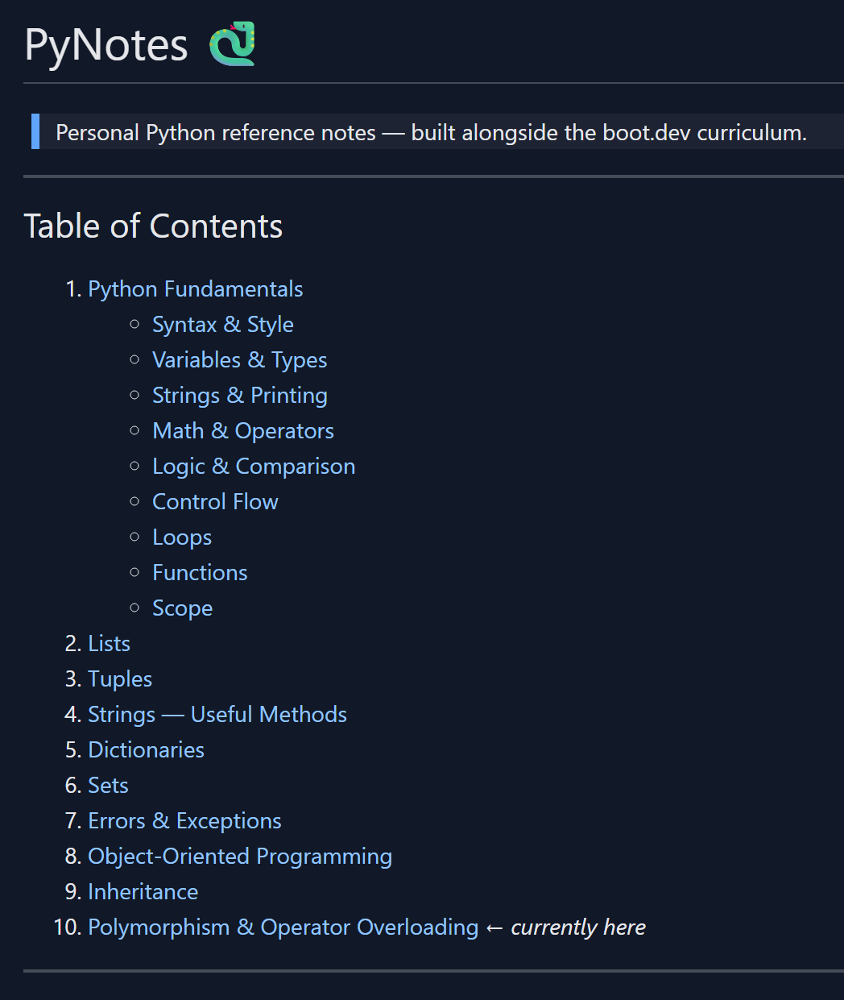

# Dev Notes

Personal reference notes built while learning to code through [boot.dev](https://boot.dev).

## Topics

- **Python** — fundamentals, data structures, OOP, polymorphism
- **JavaScript** — *coming soon*
- **Git** — *coming soon*
- **Other** — may include SQL, HTTP clients/servers, Node/Express, Docker, etc.

### Preview

## About

These are quick-reference notes for myself. They were created while working through
boot.dev courses — I'd feed my progress and assignment solutions to Claude, which
generated clean notes in markdown format. I then converted them to HTML using the
Markdown PDF extension (by yzane) in VS Code and added a custom dark-theme style override.